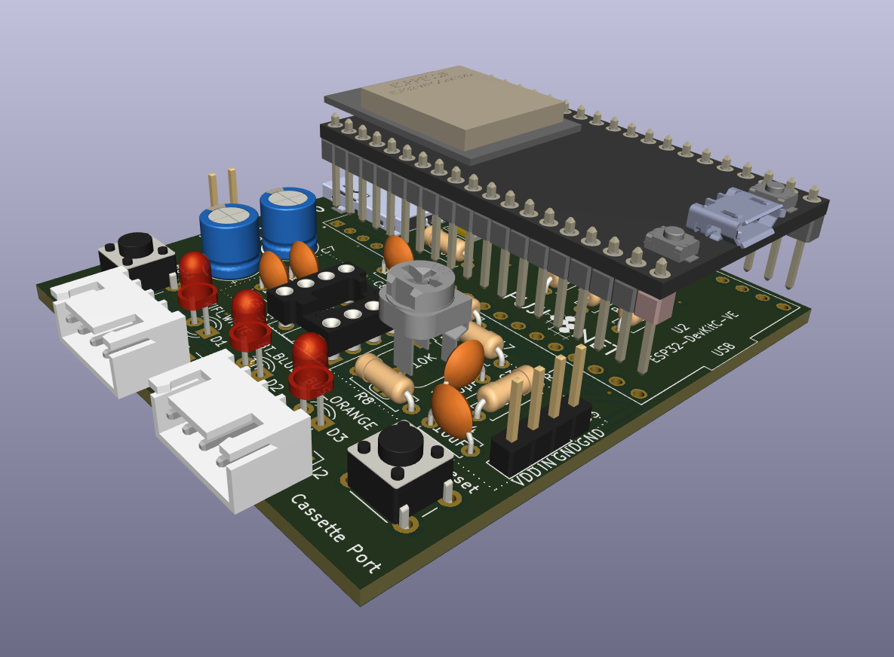

Repo for early testing of FujiNet PCB's for the Tandy Color Computer

# Rev0

Needs to be reworked to connect the CD pin of the serial port to IO22 on the ESP32.

# Rev00

Connected the CD pin of the serial port to IO22.

Schematic - https://djtersteegc.github.io/Coco-FujiNet/CoCo-FujiNet-Rev00-Schematic.pdf

Interactive BOM - https://djtersteegc.github.io/Coco-FujiNet/ibom-Rev00.html

You'll need 8.5mm high [2.54mm female header strips](https://www.aliexpress.us/item/2251832416528370.html) to mount the ESP32.  Buy the 1x40 versions and cut to length.

MicroSD socket footprint is the common [Chinese push-push version](https://www.aliexpress.us/item/2251832613969983.html) used on all the FujiNet's to date.

You can either assemble the LM386 based amp circuit, or use one of these [premade modules](https://www.aliexpress.us/item/3256805809816872.html) on the board instead. If using the module all the components in the outline area can be excluded, as well as C2 and C7.

If assembling the LM386 on the board, R17 can be used as the input resistor instead of the 10K pot once we figure out the optimal value for the Coco's tape input.

The cable sockets on the board are the cheap [XH2.54 4p angle](https://www.aliexpress.us/item/2251832735749189.html) connectors.   Buy some [prewired female connectors](https://www.aliexpress.us/item/2255801048702387.html) for cable making.  You'll need a [DIN4 male](https://www.aliexpress.us/item/3256804124853512.html) plug for the serial port, and [DIN5 male](https://www.aliexpress.us/item/3256804124853512.html) plug for the cassette port.

